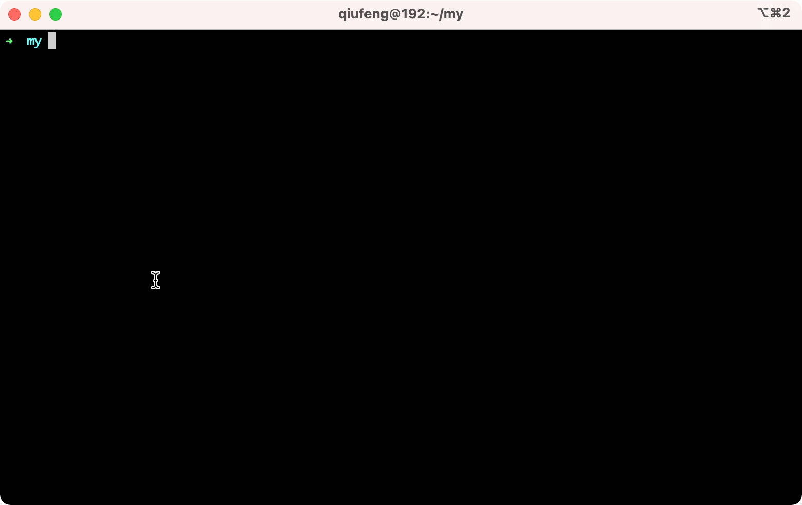

<p align="center">
  
</p>

<p align="center">
    <a href="https://npmcharts.com/compare/mmt?minimal=true" rel="nofollow"></a>
    <a href="https://www.npmjs.com/package/mmt" rel="nofollow"></a>
    <a href="https://www.npmjs.com/package/mmt" rel="nofollow"></a>
</p>

使用其他语言阅读: 简体中文 | [English](./README_en.md)

# 介绍

MMT (Manage Multiple Task) 是 MacOS + iTerm2 的一个自动执行多个命令工具，一次定义永久受益！


# 安装
```
npm i -g mmt
```
## 使用场景

### Case1: 单项目多仓库

当你的项目是拥有前后端两个工程，你总是需要记住多个命令或者是多个目录，而开启多个窗口总是会比较麻烦。

你的前端项目：case1-front, 启动命令: npm run start

你的后端项目: case1-backend, 启动命令: npm run dev

使用 mmt 声明:
```
> cd path/case1-front
> mmt add case1 start
> cd path/case1-backend
> mmt add case1 dev
```

在任意命令窗口:
```
> mmt run case1
```

效果如下(自动开启多个窗口,并在对应窗口执行命令):


### Case2: 多项目多仓库

当你一个人维护多个技术栈的项目，启动命令总是记不住，使用 Vue 项目启动命令可能是 `npm run serve`, 而使用 React 项目却是 `npm run start`, 有些项目还可能是 `npm run dev`。使用 mmt 可以抹平这种差异，并且你无须记忆你的工程路径。

你的项目1: projec1-vue, 启动命令 `npm run serve`
你的项目2: projec2-react, 启动命令 `npm run start`


使用 mmt 声明:
```
> cd path/projec1-vue
> mmt add project1 serve
> cd path/projec2-react
> mmt add project2 start
```

在任意命令窗口
```
> mmt run project1
> mmt run project2
```

效果如下:


### Case3: 脚本别名

当你想要同步运行一些流程线的工作，你就可以使用 `add-sync` 方式，例如我的某个本地项目需要依赖两个容器环境 e8a47b8aed91 和 e0d433a26388 这个时候运行 mmt 将会自动执行命令。


```
> mmt add-sync project1-dep "docker restart e8a47b8aed91"
> mmt add-sync project1-dep "docker restart e0d433a26388"
```

在任意命令窗口
```
> mmt run project1-dep
```



## API

### add

添加一个异步任务，任务会以新建一个 tab 页启动。

常见场景:

当我们有一个全栈服务的时候，我们需要启动前端和后端，这个时候我们每次都需要麻烦的切换 tab 页，然后启动两个服务

示例:
例如我的另一个项目「木及简历」是一个全栈项目，这个时候我想要快速启动前后端就可以这样做。
```
mmt add muji "cd frontend/path && npm run start";
mmt add muji "cd server/path && npm run dev";

mmt run muji
```
此时会新开两个窗口运行前端和后端服务。

### add-sync

添加一个同步任务，任务会在当前页面直接执行。

常见场景：

每当我们需要切换项目的时候，有一些预制环境，mmt能够帮助我们处理这些情况。例如我的某个本地项目需要依赖两个容器环境 e8a47b8aed91 和 e0d433a26388 这个时候运行mmt 将会自动执行命令。

```
mmt add-sync start-docker "docker restart e8a47b8aed91";
mmt add-sync start-docker "docker restart e0d433a26388";

mmt run start-docker

> docker restart e8a47b8aed91
> docker restart e0d433a26388
```
此时会在当前 tab 页里，一次运行以上两个命令


### ls

列出当前任务有哪些命令

```
mmt ls muji

> cd frontend/path && npm run start
> cd server/path && npm run dev

```

### rm
删除一个任务

`mmt rm <task>`

```
mmt rm muji
> delete muji task success!
```

### run

运行一个任务

`mmt run <task>`

```
mmt run muji
```

### export

`mmt export <task>`

导出所有配置
```
mmt export all
```

导出单个配置

```
mmt export muji
```


## License

MIT

Copyright (c) 2022- 蓝色的秋风
